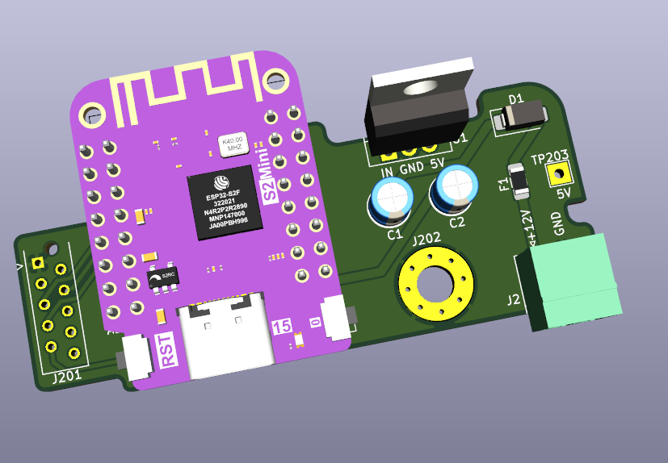

# Status

Unfinished. Untested.

# What?

This is a PCB that connects an ESP32 to a reclaimed display board from an obsolete [Octalarm-IP](https://www.adesys.nl/en/product-octalarm-ip-adesys2).

# BOM remarks

U1 should be an 5V buck converter in the footprint of a TO-220. It should be capable of outputting 5V at 1A. Input voltage should be greater than 12V.

# Assembly

Desolder the J201 MicroMatch 1.27mm socket from the display board.

Connect this PCB to the back of the display board using 2 pieces of 1x5 2.54mm pin headers in the J201 footprints.

