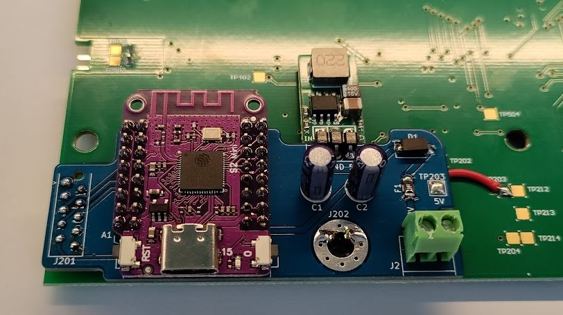
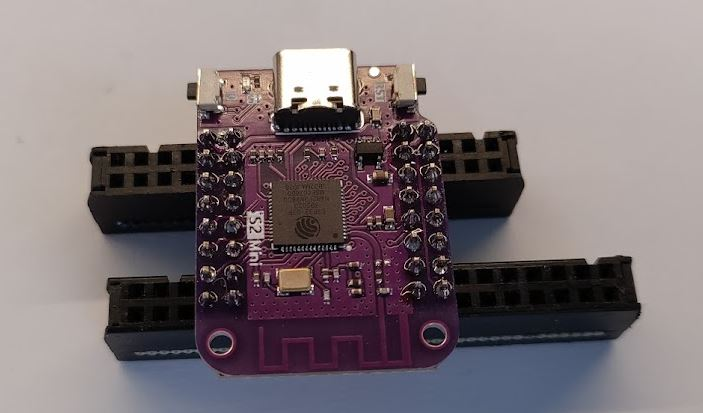
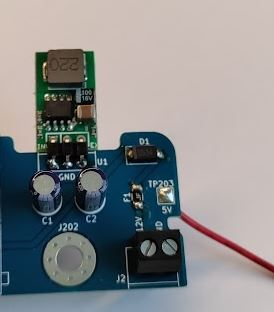
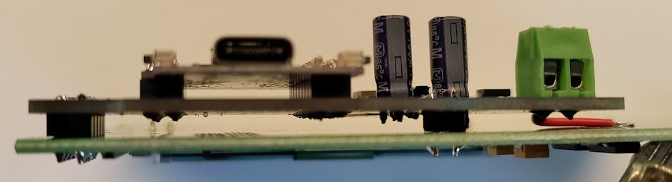

# Status

Unfinished. Untested.

# What?

This is a PCB that connects an ESP32 to a reclaimed display board from an obsolete [Octalarm-IP](https://www.adesys.nl/en/product-octalarm-ip-adesys2).

# BOM

See: [Kicad/bom/ibom.html](Kicad/bom/ibom.html)

## BOM remarks

U1 should be a 5V buck converter in the footprint of a TO-220. It should be capable of outputting 5V at 1A. Input voltage should be greater than 12V.

J201 are 2 pieces of 1x05 2.54mm pp low profile (7.5mm) pin header instead of a Micro-MaTch connector.

For connecting TP203 you need 2cm of red wire.

The ESP32-S2 should come with 2 pieces of 2x08 2.54mm pin headers. Discard them and order 4 pieces of 1x08 2.54mm pp low profile (7.5mm) pin headers.

J201 Phoenix contact 1803277+1851999 can also be 1803277+1803578.

# Soldering and assembly instructions

Solder the pin headers on the ESP32-S2, use some old IDC connectors to perfectly align the headers. Like this:

Solder F1, D1.  Solder U1 (the buck converter) laying flat (PCBs are now on the same plane). Cut pins (6 cuts) of U1 flush with PCB. Solder J2, C1 and C2. Cut pins of J2 flush with PCB. Solder one end of the red wire to TP203 on the bottom. The right side of the PCB now look like this:

Set your lab power supply to 12V CV, 0.25A CC. Then connect 12V to J2. Observe less than 10mA current. Measure 5V between TP203 and ground. Disconnect power supply.

Passed? Now solder A1 (the ESP32-S2 module). Do you not use low profile pin headers? Then cut pins flush with PCB. Works best before soldering.

Connect power supply again. Observe about 10mA current if ESP32-S2 is new and empty or about 40mA when flashed with firmware. Disconnect power supply.

Desolder the J201 MicroMatch 1.27mm socket from the display board.

Gently clean the PCB and the ESP32-S2 if you want.

Connect this PCB to the back of the display board using 2 pieces of low profile 1x5 2.54mm pin headers in the J201 footprints of both PCBs. The hole J202 on both PCB should almost align. But do not solder the header yet.
First solder a 1x02 2.54mm pin header on J202 of both PCBs to keep PCBs separated. Now solder the J201 pin header.

Solder the red wire onto the TP203 pad of the display board.

Connect power supply again. Observe about 20mA current (or 50mA when flashed). Disconnect power supply.

Make sure none of the pins (ESP32-S2, U1, J2) of this PCB touch display board:

# Firmware

Flash the firmware of the ESP32-S2. The firmware of the ATmega48 MCU of the display board is embedded in the  ESP32-S2 firmware and will be flashed by the ESP32-S2.

# 3D-printed stand

You could 3d-print [a stand](3d/WiFi-2-OIP-UI%20stand.stl) for this contraption.

# Display board

Information about the display board.

## Pinout J201

| #     | name          | remarks       | ESP32 pin |
| --    | --            | --            | --        |
| 1     | GND           |               |
| 2     | V+            | unused        |
| 3     | MCU reset     |               | IO5
| 4     | MCU interrupt | active low    | IO1
| 5     | LCD RS        |               | IO4
| 6     | SPI clock     |               | IO7
| 7     | SPI MISO      |               | IO9
| 8     | SPI MOSI      |               | IO11
| 9     | SPI SS LCD    | active low    | IO14
| 10    | SPI SS MCU    | active low    | IO12

## LCD

LCD is a 128x64 Crystal Clear Technology [G64128S18YBW00](https://www.arrow.com/en/products/g64128s18ybw00/crystal-clear-technology-sdn-bhd). It contains a [Novatek NT7534](https://www.crystalfontz.com/controllers/Novatek/NT7534/) controller.

When testing with [U8g2](https://github.com/olikraus/u8g2) using U8G2_ST7565_ERC12864_ALT results in a working LCD.

## MCU

The MCU is a TQFP-32 [Atmega48](https://www.microchip.com/en-us/product/atmega48) that is responsible for driving the 20 red and 20 green LEDs and the backlight of the LCD.

## Testpoints

| #     | name          | remarks   |
| --    | --            | --        |
| TP201 | MCU PD1       | not used
| TP202 | V+            | not used
| TP203 | 5V
| TP204 | 3.3V
| TP205 | MCU PC5, PC6  | not used
| TP206 | SPI clock
| TP207 | SPI MISO
| TP208 | SPI MOSI
| TP209 | MCU SS
| TP210 | MCU reset
| TP211 | MCU interrupt
| TP212 | 5V
| TP213 | GND
| TP214 | 3.3V
| TP301 |               | not used
| TP302 |               | not used
| TP303 |               | not used
| TP304 |               | not used
| TP305 |               | not used
| TP306 |               | not used
| TP307 |               | not used
| TP308 |               | not used
| TP309 |               | not used
| TP310 |               | not used
| TP402 | LCD reset
| TP404 | LCD SS
| TP405 | LCD RS
| TP501 |               | not used
| TP502 |               | not used
| TP503 | MCU ADC7      | not used
| TP504 | MCU PB1       | not used
| TP506 |               | not used
| TP507 |               | not used
| TP508 |               | not used

